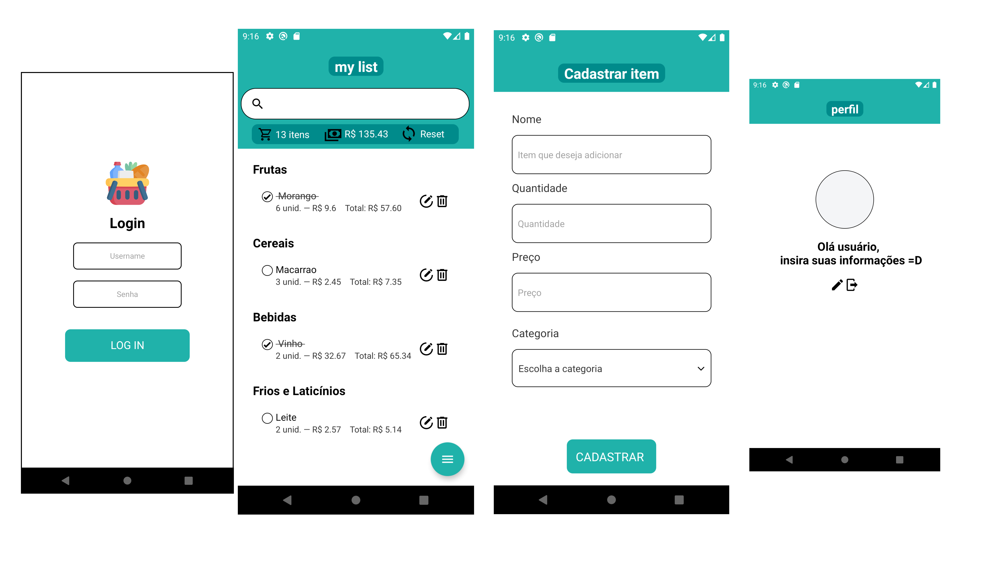

<h1 align="center">
  App Products List
</h1>



<h4 align="center">Mobile application developed to help users to list and search desired items in a supermarket list</h4>

# 💬 About
This project is a task of the Lead Dell mentoring program. It was assigned in order to better understand and acquire basic knowledge in current development techniques with React Native.

## 💻 Technologies
<ul>
  <li>React Native</li>
  <li>Javascript</li>
</ul>

## ⚡ Libraries
<ul>
  <li>Redux.js -> Application State Management</li>
  <li>Styled-Components -> Stylization of elements and components </li>
  <li>React Navigation -> Application Navigation Management </li>
  <li>react-native-vector-icons -> Application icons </li>
  <li>Lodash -> JavaScript library used to generate id's randomly. </li>
</ul>

## 🚀 Libraries used to improve development
<ul>
  <li>Eslint -> Statically analyzes code to quickly find problems </li>
  <li>Reactotron -> Used to debug the application </li>
  <li>Prettier -> Code formatter </li>
  <li>Editor config -> Text editor for maintaining a consistent coding style</li>
</ul>

## 📍 Functionalities
<ul>
  <li>Adds and lists the items divided by its categories</li>
  <li>Searchs the items</li>
  <li>Shows cart total and cart total price</li>
  <li>Resets the list after finishing shopping</li>
</ul>

##  📦 How to install the project
### Clone the repository
  ```
    git clone https://github.com/lidslira/Products-List.git
  ```
### Install the dependencies
 ```
  yarn install
 ```
### Start Metro and run your emulator
  ```
  yarn start
  yarn android
  ```

